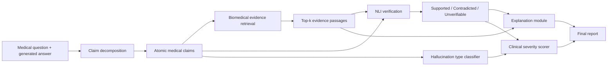

# Methodology

## System Overview

The proposed framework takes a medical question-answer pair or generated medical response as input and returns claim-level hallucination predictions, evidence, explanations, type labels, and severity scores.



## Module 1: Claim Decomposition

The answer is split into atomic claims. Each claim should be independently verifiable.

Example:

Input answer:

`Metformin cures type 1 diabetes and should be given to all pregnant patients with kidney failure.`

Atomic claims:

1. Metformin cures type 1 diabetes.
2. Metformin should be given to all pregnant patients.
3. Metformin should be given to patients with kidney failure.

Implementation options:

- Rule-based sentence and clause splitting for the first prototype.
- LLM-assisted claim decomposition for better quality.
- Biomedical dependency parsing as a later improvement.

## Module 2: Biomedical Evidence Retrieval

For each claim, the system retrieves top-k biomedical evidence passages.

Possible evidence sources:

- PubMedQA context passages.
- PubMed abstracts.
- MedHallu source context.
- Curated biomedical documents.

Recommended retrieval methods:

- BM25 baseline.
- Dense retrieval using biomedical sentence embeddings.
- Hybrid BM25 + dense retrieval.

Output:

- Top-k evidence passages.
- Retrieval score.
- Source ID or PMID when available.

## Module 3: NLI Verification

Each claim is paired with retrieved evidence and passed to an NLI model.

Labels:

- `supported`: evidence entails the claim.
- `contradicted`: evidence contradicts the claim.
- `unverifiable`: evidence does not support or contradict the claim.

Candidate models:

- DeBERTa-v3-large NLI model.
- BioClinicalBERT or PubMedBERT adapted for NLI.
- Biomedical NLI model if available.

Contradiction strength:

```text
contradiction_strength = P(contradiction)
```

If multiple evidence passages are used:

```text
claim_contradiction_strength = max(P(contradiction) over top-k evidence)
```

## Module 4: Fine-Grained Hallucination Type Classification

The system assigns a hallucination type to each unsupported or contradicted claim.

Initial taxonomy:

| Type | Meaning | Example |
|---|---|---|
| Entity error | Wrong disease, drug, organism, gene, biomarker, or patient group | Claim says insulin when evidence says metformin |
| Relation error | Wrong relationship between entities | Claim says drug treats disease when evidence says no benefit |
| Numeric/dosage error | Wrong dosage, rate, percentage, duration, or threshold | Claim says 50 mg instead of 5 mg |
| Causal/mechanistic error | Wrong biological or clinical mechanism | Claim says statins increase LDL |
| Contextual error | Claim ignores population, condition, or study context | Claim generalizes adult result to children |
| Unsupported factual error | Plausible but not grounded in retrieved evidence | Claim has no evidence in context |

This taxonomy should be aligned with MedHallu's available category field after dataset inspection.

## Module 5: Explainability

The explanation module should produce outputs that a medical user can understand.

Minimum explanation:

- Claim text.
- Predicted verification label.
- Hallucination type.
- Evidence passage.
- Contradicting or supporting evidence sentence.
- Confidence score.

Advanced explanation:

- Token highlighting using attention or gradient attribution.
- SHAP feature attribution for classifier features.
- Span-level evidence highlighting.

## Module 6: Clinical Severity Scoring

The severity score estimates how clinically risky the hallucination is.

Proposed formula:

```text
severity_score = type_weight * contradiction_strength * clinical_risk_weight
```

Example type weights:

| Hallucination type | Weight |
|---|---:|
| Numeric/dosage error | 1.00 |
| Drug/treatment entity error | 0.95 |
| Diagnosis error | 0.90 |
| Causal/mechanistic error | 0.80 |
| Relation error | 0.75 |
| Contextual error | 0.60 |
| Unsupported factual error | 0.50 |

Example clinical risk tiers:

| Risk tier | Weight |
|---|---:|
| High: treatment, dose, contraindication, diagnosis, emergency care | 1.00 |
| Medium: prognosis, risk factor, test interpretation | 0.70 |
| Low: background biomedical fact, context, citation-level error | 0.40 |

Severity categories:

```text
0.00 - 0.30: Low
0.31 - 0.60: Moderate
0.61 - 1.00: High
```

## Dataset Plan

Primary benchmark:

- MedHallu: external test and central benchmark.

Supporting datasets:

- PubMedQA: evidence and biomedical QA source.
- RAGTruth: span-level hallucination comparison.
- SciHal25: scientific claim verification reference.
- Mu-SHROOM: span-level detection reference.
- Clinical summarization safety datasets: severity taxonomy inspiration.

## Experimental Design

### Baselines

1. Binary classifier: question + answer to hallucinated/not hallucinated.
2. NLI-only: claim/evidence verification without retrieval.
3. Retrieval-only: similarity score thresholding.
4. RAG + NLI: retrieval and NLI, no type or severity.
5. Full framework: claim decomposition + RAG + NLI + type + explanation + severity.

### Metrics

Detection:

- Accuracy.
- Precision.
- Recall.
- F1.
- Macro-F1.
- Hard-case F1 on MedHallu.

Type classification:

- Macro-F1.
- Per-type precision and recall.
- Confusion matrix.

Retrieval:

- Recall@k.
- MRR.
- Evidence hit rate.

Severity:

- Agreement with manually assigned severity labels if annotated.
- Spearman correlation with clinical risk ranking.
- High-risk hallucination recall.

Explainability:

- Evidence sufficiency rating.
- Faithfulness through evidence overlap.
- Human evaluation if possible.

## Ablation Study

Recommended ablations:

1. Remove claim decomposition.
2. Remove dense retrieval.
3. Replace biomedical NLI with generic NLI.
4. Remove type classification.
5. Remove severity weighting.
6. Compare BM25 vs dense vs hybrid retrieval.

## Expected Main Claim

The full framework should improve hard-case hallucination detection compared with binary and NLI-only baselines while providing additional interpretable outputs: hallucination type, evidence, explanation, and clinical severity.

